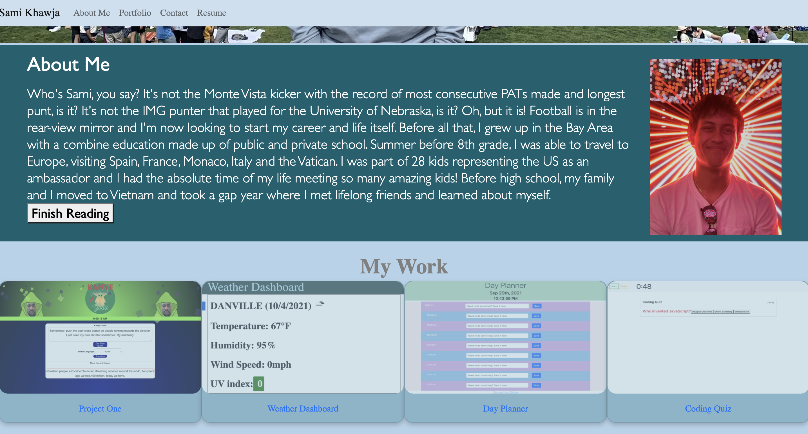

# updated_portfolio_page

<!-- TABLE OF CONTENTS -->
<details open="open">
  <summary>Table of Contents</summary>
  <ol>
    <li>
      <a href="#about-the-project">About The Project</a>
      <ul>
        <li><a href="#built-with">Built With</a></li>
      </ul>
    </li>
    <li>
      <a href="#getting-started">Getting Started</a>
    </li>
    <li><a href="#code-snippet">Code-Snippet</a></li>
    <li><a href="#license">License</a></li>
    <li><a href="#contact">Contact</a></li>
    <li><a href="#acknowledgements">Acknowledgements</a></li>
  </ol>
</details>


<!-- ABOUT THE PROJECT -->
## About The Project



For this project, we decided on creating a webpage that would display a random quote from Kanye West and you would then have the option of translating it into Yoda. There are different animations and with rounded-corners, it makes the webpage more fun and kid friendly to a certain degree... we can't control what Kanye has to say. It tested all of our previous knowledge and we were constantly researching to ensure we had the best product we could deliver to the user!

The websites we used to help create our project are listed below in the <a href="#acknowledgements">acknowledgements</a>.

### Built With

We used <a href="https://code.visualstudio.com/">Visual Studio Code</a> to create the HTML, CSS and Javascript from scratch. We had the help of Foundation for formatting the HTML and JQuery to help with the coding on the Javascript!


<!-- GETTING STARTED -->
## Getting Started

When loading this webpage, you are greeted with several animations and a quote from the one and only, Kanye. The user has the option of what language to have translated and when 'translate' is clicked a pop-up screen is presented with the translated quote and a text reader. The webpage is simple and fun, which is your favorite quote?


<!-- USAGE EXAMPLES -->
## Code Snippets

FunTranslations API must take to-be-translated-text as an input. The text must be formatted into url form. In particular, all spaces must be converted to %20.

Below is the text-reformat portion of the 'start' function that prepares the quote to be fed into the 'translate' function.
```
quoteArray=kanyeQuote.value.split(" ")
  var textInput = ""
  for (i=0;i<quoteArray.length-1;i++){
    textInput = textInput.concat(quoteArray[i]+"%20")

  }
  textInput = textInput.concat(quoteArray[quoteArray.length-1])
```
<br>

Yoda API sometimes leaves no space after punctuations, so translated quotes must be reformatted Javascript's SpeechSynthesis interface to put spaces in the correct places.

Below is the 'speak' function that makes sure the translated text has appropriate grammar before adding a new speech utterance.

```
function speak(message){

  var alphabet = ["A", "B", "C", "D", "E", "F", "G", "H", "I", "J", "K", "L", "M", "N", "O", "P", "Q", "R", "S", "T", "U", "V", "W", "X", "Y", "Z", "a", "b", "c", "d", "e", "f", "g", "h", "i", "j", "k", "l", "m", "n", "o", "p", "q", "r", "s", "t", "u", "v", "w", "x", "y", "z", "\'","\"", " "]

  var speechText = ""    
  for (i=0;i<message.length;i++){
        if (alphabet.includes(message.charAt(i))){
          speechText = speechText + message.charAt(i)
        }
        else{
          speechText = speechText + message.charAt(i)+" "
        }

      }
      console.log(speechText)
      speechSynthesis.speak(new SpeechSynthesisUtterance(speechText))
}
```


<!-- LICENSE -->
## License

Distributed under the MIT License. See `LICENSE` for more information.


<!-- CONTACT -->
Sami Khawja: Skhawja11@gmail.com


## Project Links
Project Link: [GitHub](https://github.com/samikhawja/updated_portfolio_page)

Live Link: [Project One](https://samikhawja.github.io/updated_portfolio_page/)


<!-- ACKNOWLEDGEMENTS -->
## Acknowledgements
* [W3Schools](https://www.w3schools.com/)
* [StackOverflow](https://stackoverflow.com/)
* [Mozilla](https://developer.mozilla.org/en-US/docs/Web/JavaScript)
* [Foundation](https://get.foundation)
* [JQuery](https://jquery.com/)